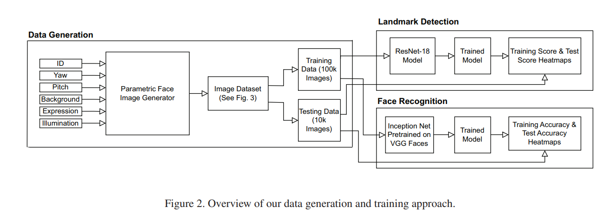
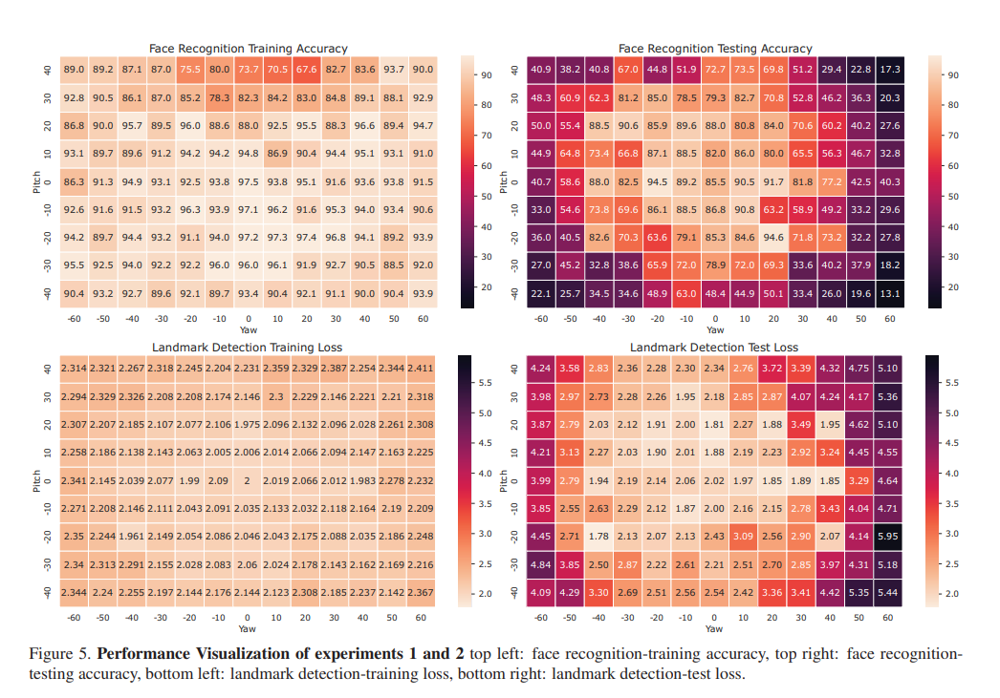
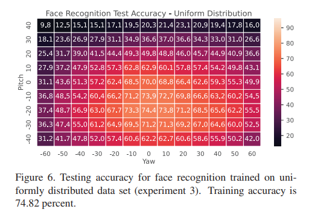

# PoseBias: On Dataset Bias and Task Difficulty - Is there an Optimal Camera Position for Facial Image Analysis?

## Abstract

Let’s imagine you could choose the position of the camera for a particular face analysis task - where would you put it? In this work, we provide a first analysis based on synthetic training data to provide evidence that this choice is not trivial, not only dependent on the training data and different based on the task. We provide results for two major face analysis tasks, face recognition and landmark detection. For our experiments, we use a 3D Morphable Model as it provides us full control over pose, illumination, and identity to generate idealized training data. Whilst rendered images are not photorealistic we avoid any confounding factors and biases from other sources (e.g. pose bias in training data).

Our results show that the optimal camera poses are near frontal but not exactly frontal and dependent on the task. By comparing the results obtained by pose-specific training set to a uniform training distribution without pose bias we show that the accuracy for both tasks not only depends on the bias in the training data but is actually dominated by the difficulty of the task depending on the particular pose. These things are significant in the deployments and designs of face analysis systems, for example, driver monitoring, and entertainment applications since the camera’s position is critical depending on the task it is assigned to in achieving better accuracy and reliability rates.

## Methodology

Synthetic Data Generation: We used an open-source tool (https://github.com/unibas-gravis/parametric-face-image-generator) which utilizes 3D Morphable Model to create a synthetic dataset of facial images. This allowed us to control pose, illumination, and identity factors meticulously, avoiding the confounding variables present in real-world data. 

Camera Positions Setup: Experiments were conducted across 117 distinct camera angles and positions (by varing the yaw and pitch angle), ensuring to capture a diverse range of perspectives. We generate 1,000 identities for each experiment. For each identity, we generate 100 images for training and 10 images for testing.

Tasks:
Face Recognition: This task is a classification problem that involves identifying the individual in each image. We use Inception net that has been pre-trained on the VGG faces dataset and use the technique of transfer learning for training it on our data. We adapted the architecture for this task by removing the last layer and replacing it with a layer for 1000 classes/identities.

Facial Landmark Detection: This task is a regression problem, that involves detecting specific points on the face, such as the eyes, nose, and mouth. We are determining 19 facial landmarks. We use ResNet-18 and train this model on our data. We removed the last layer and added one with 3 x 19 = 57 nodes and trained this new layer from scratch.

## Results

Our results (as shown in the following heatplots) demonstrates that for both Face recognition and faicail landmark detection, Near-frontal camera positions were found to be optimal. This position ensures minimal occlusion and distortion of facial features,and clear visibility of facial landmarks, leading to higher recognition accuracy.

